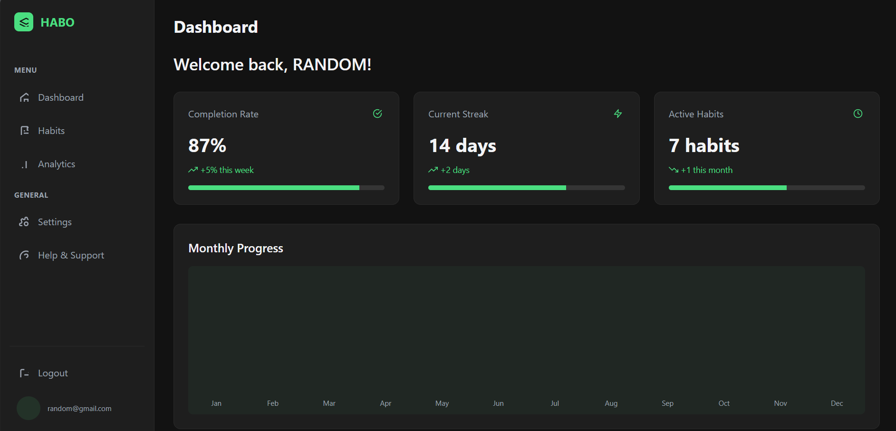

# 🚀 Habit Builder - Your Personal Habit Tracking Companion  

**Build better habits, one day at a time.**  

Habit Builder is a modern, intuitive habit-tracking application designed to help you establish and maintain positive routines. With beautiful visualizations, personalized reminders, and insightful analytics, staying consistent with your goals has never been easier.  

Habit Builder Dashboard Preview


## ✨ Why Habit Builder?  

We all know how hard it is to build lasting habits. Habit Builder takes the guesswork out of self-improvement by:  

✅ **Tracking your progress** with clear, actionable insights  
✅ **Motivating you** with streaks and achievements  
✅ **Adapting to your lifestyle** with customizable reminders and goals  
✅ **Looking great** with a sleek, dark-mode-friendly UI  

---

## 🔥 Key Features  

### 📌 **Core Functionality**  
- **Secure authentication** (Email/Password or Google Login)  
- **Create, edit, and organize habits** with custom categories and colors  
- **Set flexible goals** (daily, weekly, or custom frequencies)  
- **Mark habits as complete** with a single tap  

### 📈 **Progress Tracking**  
- **Visual streak counter** to keep you motivated  
- **Interactive charts** (weekly/monthly progress)  
- **Completion percentage** to measure consistency  
- **Historical data** to reflect on your journey  

### 🎨 **User Experience**  
- 🌙 **Dark/Light Mode** – Easy on the eyes, day or night  
- 📱 **Fully Responsive** – Works on desktop, tablet, and mobile  
- 🔔 **Smart Reminders** – Never forget a habit again  
- � **Minimalist Design** – Focus on what matters  

---

## 🛠 Tech Stack  

| Category       | Technology |  
|---------------|------------|  
| **Frontend**  | React 19 (Hooks API) |  
| **Styling**   | `styled-components` + CSS Modules |  
| **Routing**   | React Router v7 |  
| **Backend**   | Firebase (Auth, Firestore) |  
| **Charts**    | Recharts |  
| **Build Tool**| Vite |  

---

## 🛠️ **Getting Started**  

### Prerequisites  
- Node.js (v18+)  
- npm / yarn  
- Firebase project (for backend setup)  

### Installation  

1. **Clone the repo**  
   ```bash
   git clone https://github.com/yourusername/habit-builder.git
   cd habit-builder
   ```

2. **Install dependencies**  
   ```bash
   npm install
   ```

3. **Set up Firebase**  
   - Create a `.env` file in the root directory:  
     ```env
     VITE_FIREBASE_API_KEY=your-api-key
     VITE_FIREBASE_AUTH_DOMAIN=your-auth-domain
     VITE_FIREBASE_PROJECT_ID=your-project-id
     VITE_FIREBASE_STORAGE_BUCKET=your-storage-bucket
     VITE_FIREBASE_MESSAGING_SENDER_ID=your-sender-id
     VITE_FIREBASE_APP_ID=your-app-id
     ```

4. **Run the development server**  
   ```bash
   npm run dev
   ```

---

## 📂 **Project Structure**  

```bash
habit-builder/
├── public/                # Static assets (favicon, etc.)
├── src/
│   ├── assets/            # Images, icons, fonts
│   ├── components/        # Reusable UI components
│   │   ├── common/        # Buttons, modals, inputs
│   │   ├── habits/        # Habit cards, forms
│   │   ├── charts/        # Progress visualizations
│   │   └── ui/            # Layout components (navbar, sidebar)
│   │
│   ├── contexts/          # React context providers
│   │   ├── AuthContext.jsx
│   │   └── ThemeContext.jsx
│   │
│   ├── firebase/          # Firebase config & services
│   │   ├── config.js      # Firebase initialization
│   │   ├── auth.js        # Auth functions
│   │   └── db.js         # Firestore operations
│   │
│   ├── hooks/             # Custom React hooks
│   │   ├── useAuth.jsx
│   │   └── useHabits.jsx
│   │
│   ├── pages/             # App screens
│   │   ├── Auth/          # Login/Signup pages
│   │   ├── Dashboard.jsx  # Main analytics view
│   │   ├── Habits.jsx     # Habit management
│   │   └── Settings.jsx   # User preferences
│   │
│   ├── styles/            # Global CSS & themes
│   ├── utils/             # Helper functions
│   ├── App.jsx            # Root component
│   └── main.jsx           # App entry point
│
├── .env.local             # Environment variables (ignored in git)
├── vite.config.js         # Build configuration
└── package.json          # Dependencies & scripts
```

---

## 🚀 **How to Use Habit Builder**  

### 1️⃣ **Authentication**  
- Sign up with email or Google  
- Securely stored in Firebase Auth  

### 2️⃣ **Adding Habits**  
- Click **"Add Habit"**  
- Set:  
  - Name (e.g., "Drink Water")  
  - Frequency (Daily, 3x/week, etc.)  
  - Reminder (optional)  
  - Color & icon for visual distinction  

### 3️⃣ **Tracking Progress**  
- ✔️ Check off habits each day  
- 📊 View streaks & completion rates  
- 🔄 Adjust goals as needed  

### 4️⃣ **Analyzing Data**  
- View **weekly/monthly trends**  
- Track **longest streaks**  
- Identify **weak spots** in your routine  

---

## 🤝 **Contributing**  

We welcome contributions! Here’s how:  

1. **Fork** the repository  
2. **Create a branch** (`git checkout -b feature/new-feature`)  
3. **Commit changes** (`git commit -m "Add amazing feature"`)  
4. **Push** (`git push origin feature/new-feature`)  
5. **Open a Pull Request**  

---

## 🙏 **Acknowledgments**  
- **Firebase** for seamless backend integration  
- **Recharts** for beautiful data visualization  
- **React Icons** for a sleek icon set  
- **Vite** for ultra-fast builds  

---

## 📜 **License**  
MIT © [Your Name]  

---

**Ready to build better habits?** ⭐ Star the repo and start tracking today! 🚀
